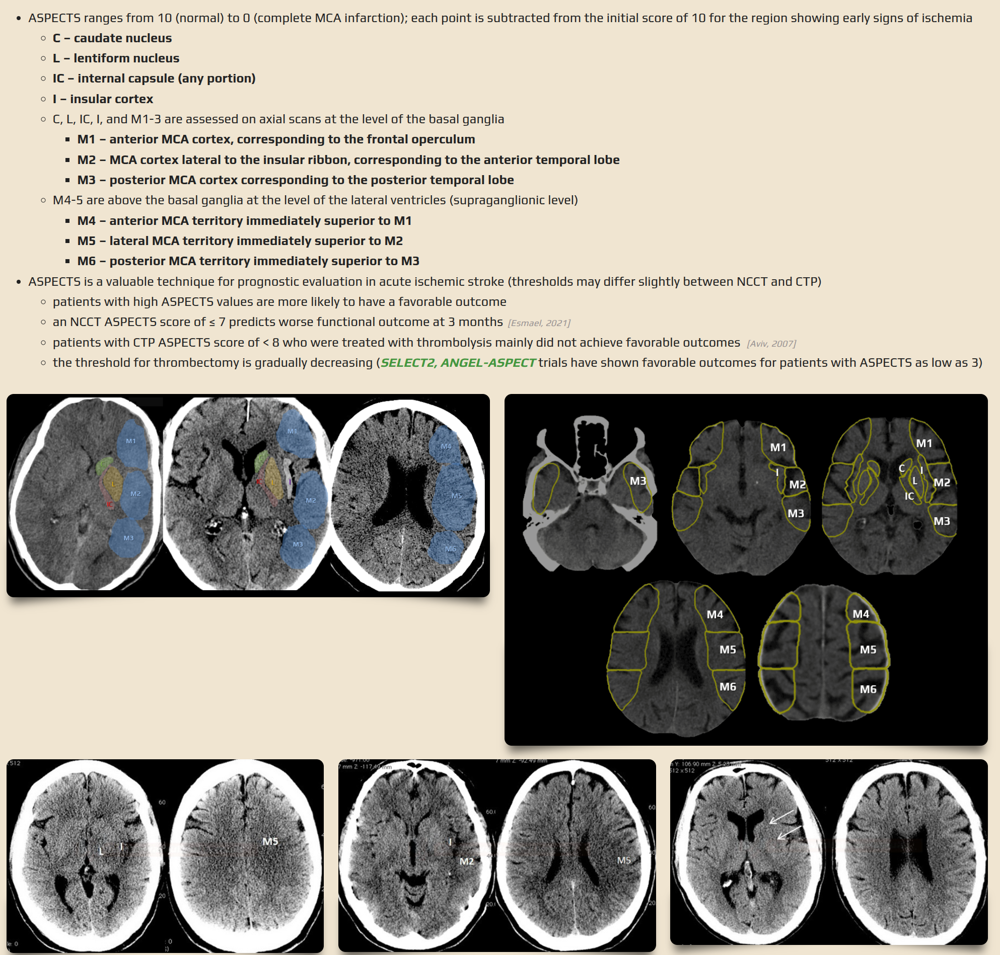

# ASPECTS (Alberta Stroke Program Early CT Score) 

See also https://www.stroke-manual.com/aspect-score/

ASPECTS (Alberta Stroke Program Early CT Score) is a 10-point quantitative scoring system used to assess early ischemic changes in stroke patients [1][4]. These early changes are taken as indicative that that area is likely unsalvageable.

ASPETCS may be measured by:

* non-contrast CT (NCCT)
* CT perfusion (CTP)
* CTA source images (CTA-SI) 

## Key Components

- Initial score starts at 10 (normal) and points are deducted for each affected region
- Evaluates specific regions in the middle cerebral artery (MCA) territory:
  
**Subcortical Structures**

- Caudate nucleus
- Lentiform nucleus 
- Internal capsule
- Insular cortex [6]

**Cortical Regions (M1-M6)**

- M1: Anterior MCA cortex (frontal operculum)
- M2: MCA cortex lateral to insular ribbon
- M3: Posterior MCA cortex
- M4-M6: Superior territories [1]

## Map of regions

## Clinical Significance

The score serves multiple important purposes:
- Predicts functional outcomes in stroke patients
- Guides treatment decisions for mechanical thrombectomy
- Helps assess eligibility for interventional treatments [3]

**Key Thresholds:**
- ASPECTS ≥8: Higher chance for independent outcome
- ASPECTS ≤7: Predicts worse functional outcome at 3 months
- ASPECTS ≤4: Poor response to intravascular treatment [4]

## Variations

**PC-ASPECTS:** A modified version for posterior circulation strokes that evaluates:
- Thalami (1 point each)
- Midbrain (2 points)
- Pons (2 points)
- Cerebellar hemispheres (1 point each)
- Occipital lobes (1 point each) [1]

ASPECTS can be assessed using different imaging modalities:
- Non-contrast CT
- CT perfusion
- CTA source images [6]

## Citations

[1] https://pmc.ncbi.nlm.nih.gov/articles/PMC8515558/

[2] https://pubmed.ncbi.nlm.nih.gov/33509915/

[3] https://pmc.ncbi.nlm.nih.gov/articles/PMC5226934/

[4] https://radiogyan.com/aspects-score-calculator/

[5] https://www.nature.com/articles/s41598-023-30242-6

[6] https://www.stroke-manual.com/aspect-score/

[7] https://pmc.ncbi.nlm.nih.gov/articles/PMC7974585/

[8] https://www.ahajournals.org/doi/10.1161/STROKEAHA.117.016745

[9] https://www.frontiersin.org/journals/neurology/articles/10.3389/fneur.2016.00245/full

[10] https://www.rapidai.com/aspect-score-stroke

[11] https://www.nnuh.nhs.uk/publication/download/alberta-stroke-program-early-ct-score-aspects-score-form-v2/

[12] https://radiopaedia.org/articles/alberta-stroke-programme-early-ct-score-aspects?lang=gb

[13] https://www.stroke.org/en/about-stroke/effects-of-stroke

[14] https://www.mayoclinic.org/diseases-conditions/stroke/symptoms-causes/syc-20350113

[15] https://www.hopkinsmedicine.org/health/conditions-and-diseases/stroke/effects-of-stroke

# Is ASPECTS measuring area of brain death?

ASPECTS (Alberta Stroke Program Early CT Score) measures early ischemic changes on CT scans obtained in the first few hours after stroke onset, which represent early cytotoxic edema and potentially irreversible injury[1]. 

## Areas Measured

The score evaluates 10 specific regions in the middle cerebral artery (MCA) territory, starting with a perfect score of 10 and subtracting one point for each region showing signs of early ischemic change[4]. These changes are assessed through:

- **Parenchymal hypoattenuation**: Areas showing abnormally decreased density compared to normal tissue
- **Focal brain swelling**: Areas showing compression of CSF spaces or sulci[1]

## Clinical Significance

ASPECTS helps predict tissue fate rather than just blood supply disruption. It is particularly important because:

- It helps identify patients suitable for thrombolysis and mechanical thrombectomy
- Scores ≥8 indicate better chances for independent outcomes
- Scores ≤4 suggest poor response to intravascular treatment[6]

## Relationship to Core and Penumbra

While ASPECTS identifies early changes, it's important to understand that in acute stroke:

- The ischemic core (tissue with blood flow <10 mL/100g/min) represents cells that die within minutes
- The penumbra (tissue with blood flow <25 mL/100g/min) represents potentially salvageable tissue that remains viable for several hours[8]

Therefore, ASPECTS helps identify early tissue changes that may indicate irreversible damage, rather than just areas of compromised blood supply.

## Citations:

[1] https://pmc.ncbi.nlm.nih.gov/articles/PMC7974585/

[2] https://www.ahajournals.org/doi/10.1161/STROKEAHA.117.016745

[3] https://www.nature.com/articles/s41598-023-30242-6

[4] https://www.stroke-manual.com/aspect-score/

[5] https://pubmed.ncbi.nlm.nih.gov/28127292/

[6] https://radiogyan.com/aspects-score-calculator/

[7] https://www.physio-pedia.com/Stroke:_Assessment

[8] https://emedicine.medscape.com/article/1916852-overview

[9] https://www.ncbi.nlm.nih.gov/books/NBK499997/

[10] https://www.ncbi.nlm.nih.gov/books/NBK546635/

[11] https://www.ebmedicine.net/media_library/files/Acute-Stroke-Imaging-CRAO-Calculator.pdf
