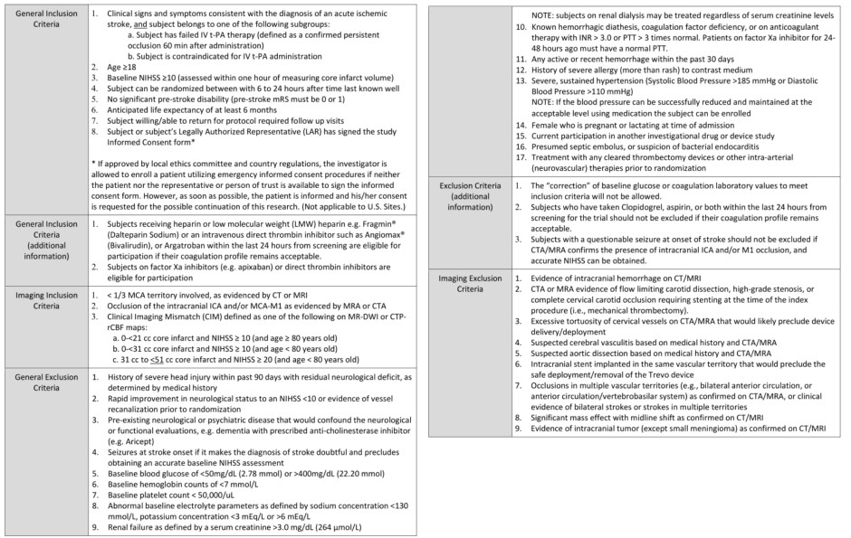
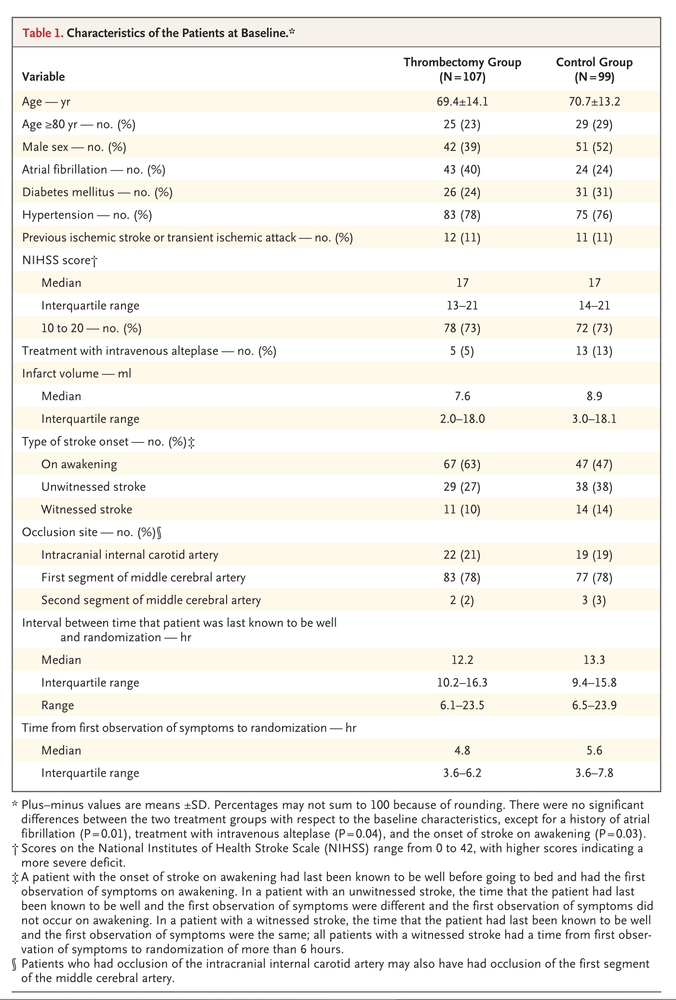
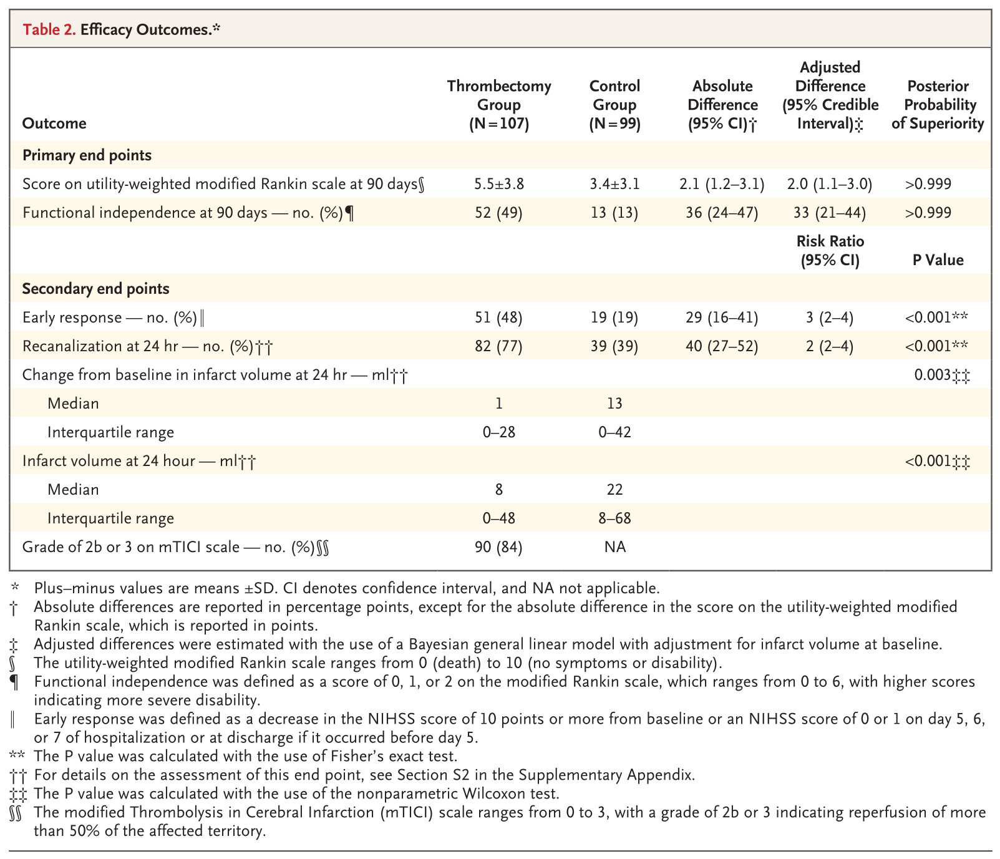
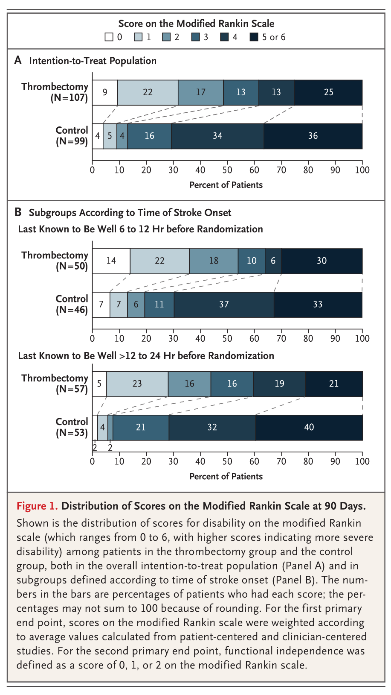
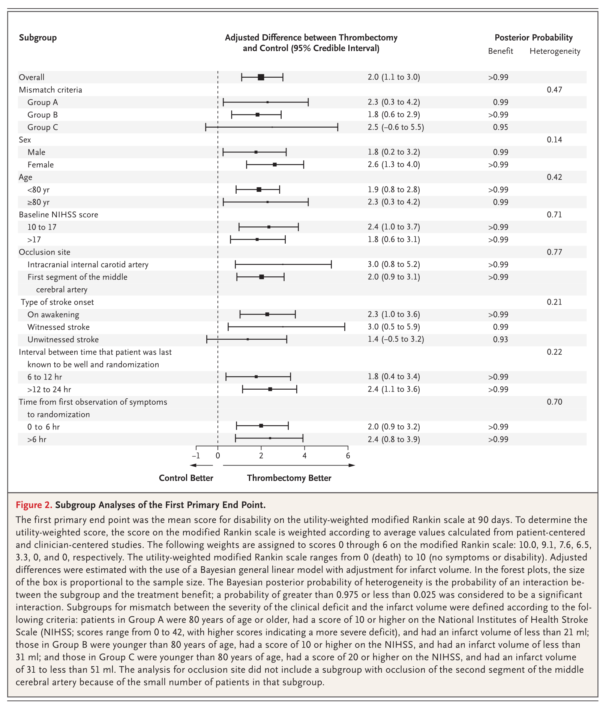
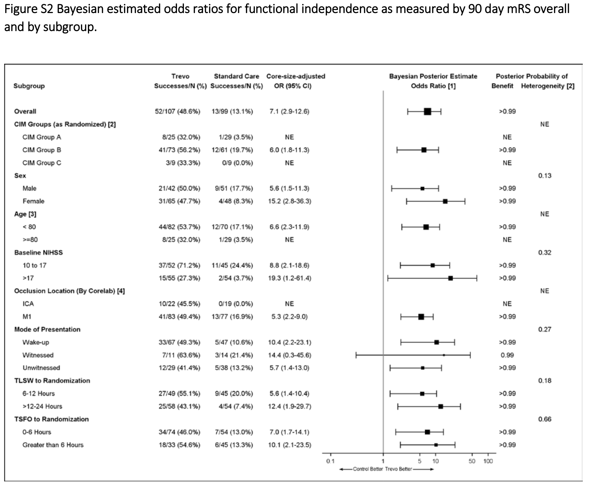
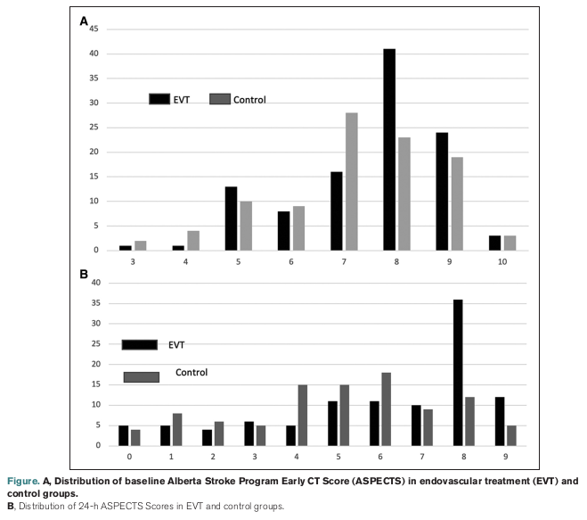

# Dawn trial

## Papers

[1] Key results
[2] Relationship between 24 hour ASPECTS, outcome, and thrombectomy

## Study population

* Patients last known well between 6-24 hours earlier.

* 206 patients were enrolled, with 107 assigned to thrombectomy. The trial was stopped at this point due to the clear positive results in an interim analysis

* Patients selected on mismatch between symptoms and core infarct (unsalvageable brain tissue) size. The rationale behind using this mismatch was to identify patients who had a relatively small core infarct but a significant clinical deficit (sever stroke symptoms), suggesting the presence of a larger area of potentially salvageable brain tissue.

* Patients were randomly assigned to thrombectomy plus standard care (the thrombectomy group) or to standard care alone (the control group).

### Key inclusion criteria

* IVT is contra-indicated or has failed (confirmed persistent occlusion 60 min after administration)

* NIHSS >= 10

* Pre-stroke disability 0-1

* Excludes severe sustained hypertension (Systolic Blood Pressure >185 mmHg or Diastolic Blood Pressure >110 mmHg)

### What is mismatch

The DAWN trial used the concept of a "clinical-imaging mismatch" to select patients for thrombectomy. This mismatch refers to a discrepancy between the severity of a patient's clinical deficit and the size of the infarct on imaging.

Here's a breakdown of the key elements of the mismatch:

* **Clinical Deficit:** This is measured using the National Institutes of Health Stroke Scale (NIHSS). The NIHSS assesses the severity of a patient's neurological deficits, such as weakness, speech difficulties, and vision problems.

* **Infarct Volume:** This refers to the area of the brain that has already suffered irreversible damage due to the stroke. It is measured using either Diffusion-Weighted Imaging (DWI) on MRI or relative Cerebral Blood Flow (rCBF) on CT Perfusion (CTP).

* **Mismatch Definition:** The DAWN trial defined the clinical-imaging mismatch using three specific criteria:

  * Patients 80 years or older with an NIHSS score of 10 or greater and a core infarct volume of less than 21 cc.
    
  * Patients under 80 years old with an NIHSS score of 10 or greater and a core infarct volume of less than 31 cc

  * Patients under 80 years old with an NIHSS score of 20 or greater and a core infarct volume between 31 cc and 50 cc.

The rationale behind using this mismatch was to identify patients who had a relatively small core infarct but a significant clinical deficit, suggesting the presence of a larger area of potentially salvageable brain tissue. The DAWN trial hypothesized that patients with a large mismatch between clinical deficit and infarct volume would have a higher likelihood of benefiting from reperfusion therapy. The idea was that in these patients, the tissue surrounding the core infarct, known as the penumbra, was still at risk of infarction but potentially salvageable with thrombectomy.

The trial used the RAPID software to standardise the measurement of core infarct volume across all study sites. The NIHSS assessment had to be performed within 1 hour of the imaging used to qualify a patient for the study.

It is also noted that the clinical-core mismatch was found to be a better predictor of infarct growth than mean transit time-diffusion (MTT-DWI) mismatch in patients with proximal middle cerebral artery occlusion and small infarct core on presentation.

## Results

* The mean score on the utility-weighed modified Rankin scale at 90 days was 5.5 in the thrombectomy group as compared with 3.4 in the control group.

* The rate of functional independence at 90 days was 49% in the thrombectomy group as compared with 13% in the control group. Odds change from 0.149 in the control group to 0.961 in the thrombectomy group (odds ratio 6.45).

* The rate of symptomatic intracranial hemorrhage did not differ significantly between the two groups (6% in the thrombectomy group and 3% in the control group, P = 0.50), nor did 90-day mortality (19% and 18%, respectively; P = 1.00).

No significant differences in efficacy (change in utility-weighted mRS) were observed between patients in the 6-12 hour and 12-24 hour (from last seen well) groups.

No significant differences in efficacy (change in utility-weighted mRS) were observed in other subgroups.

Additional results on independent living mRS 0-2

### Notes

* The outcomes in the control group were worse than outcomes in the the control group in the main clinical trials for thrombectomy. This is likely due to 1) the DAWN trial removing patients who had had a good response to IVT, 2) the Dawn trial containing a higher proportion of patients aged 80+ or with NIHSS >= 10.

## Secondary analysis of predictive value of ASPECTS

Liebeskind et al. [2] analysed DAWN results by ASPECTS score, which estimates the area of brain, the 'core', that is likely unsalvageable (low scores predict worse outcomes, with ASPECTs reducing as the infarct core grows). Most studies on ASPECTS have followed patients presenting (and being treated) earlier. Analysis of DAWN allows a study of how ASPECTS relates to outcomes in late-presenting stroke.

24 hour ASPECTS was associated with improved 90 day clinical outcome (mRS 0-2). Treatment with thrombectomy improved 24 hour ASPECTS compared to controls. The mean ASPECTS change from baseline to 24 hours was −1.8 among all late window patients, −1.4 among patients treated with EVT, and −1.1 among patients with successful recanalization.

The DAWN trial was designed to select patients with smaller core volume, and this is reflected by 55% having ASPECTS of 8-10, but there were patients with baseline ASPECTS as low as 3.

## Citations

[1] Nogueira et al. (2018) Thrombectomy 6 to 24 Hours after Stroke with a Mismatch
between Deficit and Infarct. New Eng J Med. 378:11-21.

[2] Liebeskind et al. (2021) Serial ASPECTS in the DAWN Trial. Infarct Evolution and Clinical Impact. Stroke 52:3318–3324.
